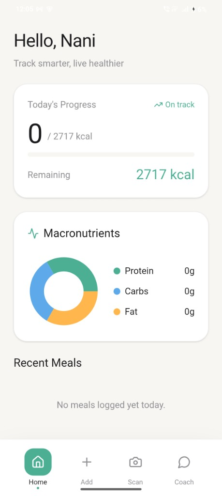
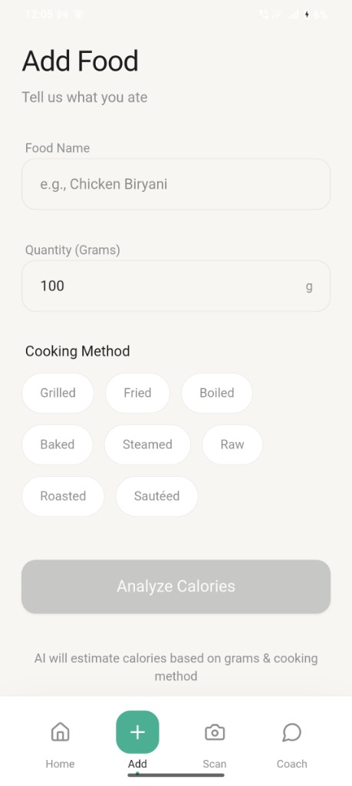
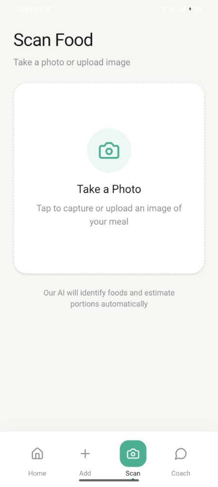
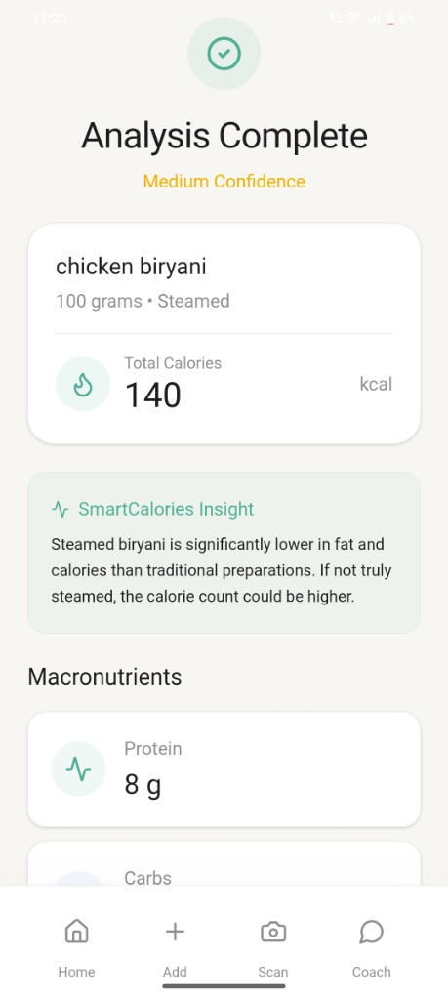

# 🍏 Click@Nutri

**Click@Nutri** is a premium, AI-powered nutrition tracking application designed for a seamless mobile experience. It leverages the latest **Google Gemini AI** models to estimate calories and macronutrients from food names or images, eliminating the need for tedious manual data entry.

## 📱 App Preview

<p align="center">
  
  
  
  
</p>

## ✨ Features

- 🤖 **AI Food Analysis**: Powered by Gemini 2.5 Flash for instant calorie and macro (Protein, Carbs, Fat) estimation.
- 📸 **Visual Tracking**: Scan food using your camera for effortless logging.
- 🎨 **Premium UI**: Modern, high-fidelity components built with a "Health + Apple-style" aesthetic.
- 🧹 **History Management**: Easily track your daily intake and delete unwanted reports with one tap.
- 🔒 **Privacy First**: All meal data is stored locally on your device using Capacitor Preferences.
- 📱 **Cross-Platform**: Built with React and Capacitor, ready to run as a native Android app.

## 🚀 Tech Stack

- **Frontend**: React.js, Tailwind CSS, Framer Motion
- **Mobile Bridge**: Ionic Capacitor
- **AI Engine**: Google Gemini API (2.5 Flash)
- **Icons**: Lucide React
- **Persistence**: Capacitor Preferences

## 🛠️ Getting Started

### Prerequisites

- Node.js (v18+)
- Android Studio (for mobile builds)
- A Gemini API Key from [Google AI Studio](https://aistudio.google.com/)

### Installation

1. **Clone the repository**:
   ```bash
   git clone https://github.com/Nani509167/Smart-calories.git
   cd Smart-calories
   ```

2. **Configure API Key 🔒**:
   Instead of hardcoding, this app securely uses `.env` files.
   - Go to `client/` and create a `.env` file containing: `VITE_GEMINI_API_KEY=your_key_here`
   - Go to `server/` and create a `.env` file containing: `GEMINI_API_KEY=your_key_here`
   *(Get your free key from [Google AI Studio](https://aistudio.google.com/))*

3. **Run Locally (Windows Easiest Method)**:
   Simply double-click the included batch scripts in your file explorer:
   - `run_server.bat` (Starts the backend)
   - `run_client.bat` (Starts the frontend)

   *Alternatively via terminal*:
   ```bash
   # Terminal 1 (Server)
   cd server && npm install && node index.js
   
   # Terminal 2 (Client)
   cd client && npm install && npm run dev
   ```

### Building for Android

1. **Generate Build**:
   ```bash
   npm run build
   npx cap sync android
   ```

2. **Open in Android Studio**:
   Open the `/client/android` folder and press **Run**.

## 📄 License

This project is licensed under the MIT License - see the LICENSE file for details.

---
*Built with ❤️ for a healthier lifestyle.*
